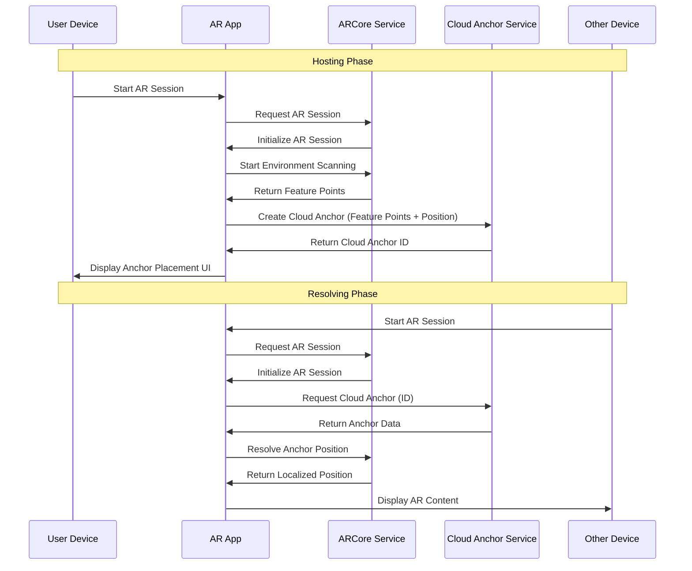
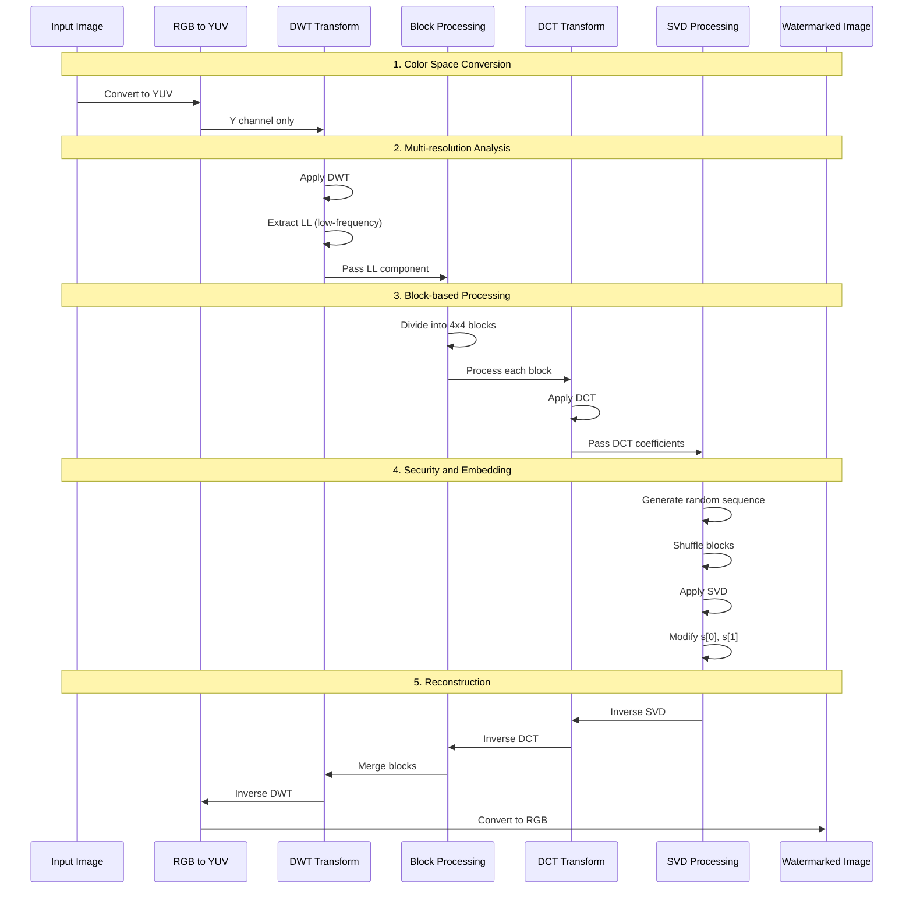
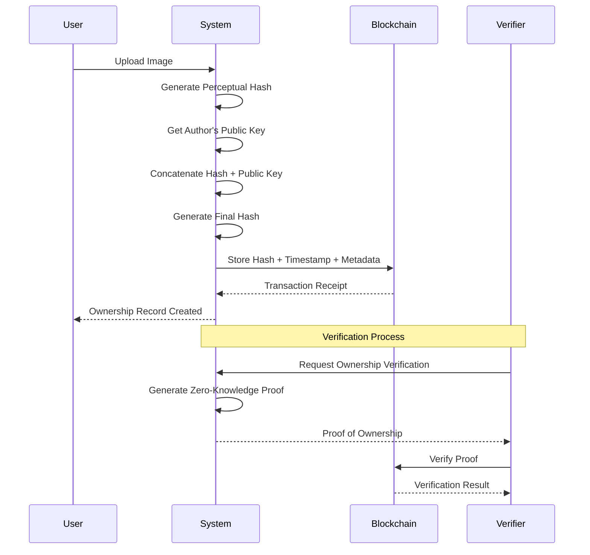
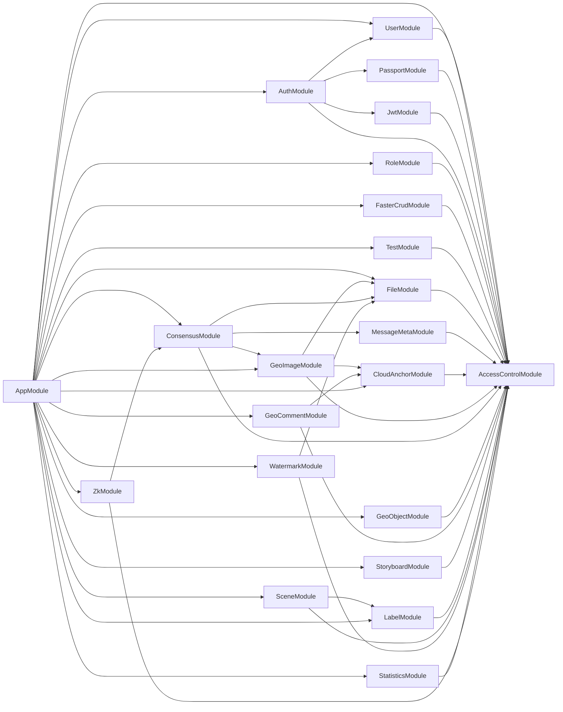
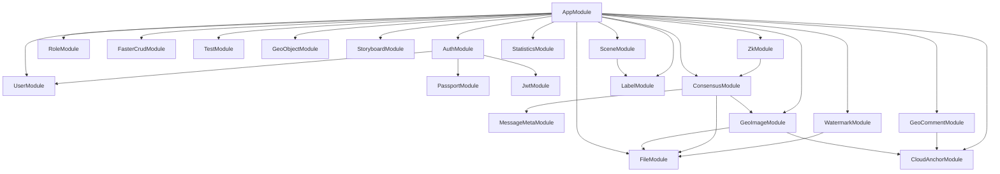

```mermaid
sequenceDiagram
    participant User as User Device
    participant App as AR App
    participant ARCore as ARCore Service
    participant Cloud as Cloud Anchor Service
    participant Other as Other Device

    Note over User,Other: Hosting Phase
    User->>App: Start AR Session
    App->>ARCore: Request AR Session
    ARCore->>App: Initialize AR Session
    App->>ARCore: Start Environment Scanning
    ARCore->>App: Return Feature Points
    App->>Cloud: Create Cloud Anchor (Feature Points + Position)
    Cloud->>App: Return Cloud Anchor ID
    App->>User: Display Anchor Placement UI

    Note over User,Other: Resolving Phase
    Other->>App: Start AR Session
    App->>ARCore: Request AR Session
    ARCore->>App: Initialize AR Session
    App->>Cloud: Request Cloud Anchor (ID)
    Cloud->>App: Return Anchor Data
    App->>ARCore: Resolve Anchor Position
    ARCore->>App: Return Localized Position
    App->>Other: Display AR Content
```

```mermaid
sequenceDiagram
    participant Input as Input Image
    participant RGB2YUV as RGB to YUV
    participant DWT as DWT Transform
    participant Block as Block Processing
    participant DCT as DCT Transform
    participant SVD as SVD Processing
    participant Output as Watermarked Image

    Note over Input,Output: 1. Color Space Conversion
    Input->>RGB2YUV: Convert to YUV
    RGB2YUV->>DWT: Y channel only

    Note over Input,Output: 2. Multi-resolution Analysis
    DWT->>DWT: Apply DWT
    DWT->>DWT: Extract LL (low-frequency)
    DWT->>Block: Pass LL component

    Note over Input,Output: 3. Block-based Processing
    Block->>Block: Divide into 4x4 blocks
    Block->>DCT: Process each block
    DCT->>DCT: Apply DCT
    DCT->>SVD: Pass DCT coefficients

    Note over Input,Output: 4. Security and Embedding
    SVD->>SVD: Generate random sequence
    SVD->>SVD: Shuffle blocks
    SVD->>SVD: Apply SVD
    SVD->>SVD: Modify s[0], s[1]

    Note over Input,Output: 5. Reconstruction
    SVD->>DCT: Inverse SVD
    DCT->>Block: Inverse DCT
    Block->>DWT: Merge blocks
    DWT->>RGB2YUV: Inverse DWT
    RGB2YUV->>Output: Convert to RGB
```

```mermaid

  sequenceDiagram
    participant User
    participant System
    participant Blockchain
    participant Verifier

    User->>System: Upload Image
    System->>System: Generate Perceptual Hash
    System->>System: Get Author's Public Key
    System->>System: Concatenate Hash + Public Key
    System->>System: Generate Final Hash
    System->>Blockchain: Store Hash + Timestamp + Metadata
    Blockchain-->>System: Transaction Receipt
    System-->>User: Ownership Record Created

    Note over Verifier, System: Verification Process
    Verifier->>System: Request Ownership Verification
    System->>System: Generate Zero-Knowledge Proof
    System-->>Verifier: Proof of Ownership
    Verifier->>Blockchain: Verify Proof
    Blockchain-->>Verifier: Verification Result

```

```mermaid
graph LR
  AppModule-->AccessControlModule
  AppModule-->UserModule
  UserModule-->AccessControlModule
  AppModule-->AuthModule
  AuthModule-->UserModule
  AuthModule-->PassportModule
  PassportModule-->AccessControlModule
  AuthModule-->JwtModule
  JwtModule-->AccessControlModule
  AuthModule-->AccessControlModule
  AppModule-->RoleModule
  RoleModule-->AccessControlModule
  AppModule-->FasterCrudModule
  FasterCrudModule-->AccessControlModule
  AppModule-->TestModule
  TestModule-->AccessControlModule
  AppModule-->FileModule
  FileModule-->AccessControlModule
  AppModule-->ConsensusModule
  ConsensusModule-->MessageMetaModule
  MessageMetaModule-->AccessControlModule
  ConsensusModule-->GeoImageModule
  GeoImageModule-->FileModule
  GeoImageModule-->CloudAnchorModule
  CloudAnchorModule-->AccessControlModule
  GeoImageModule-->AccessControlModule
  ConsensusModule-->FileModule
  ConsensusModule-->AccessControlModule
  AppModule-->GeoObjectModule
  GeoObjectModule-->AccessControlModule
  AppModule-->GeoImageModule
  AppModule-->GeoCommentModule
  GeoCommentModule-->CloudAnchorModule
  GeoCommentModule-->AccessControlModule
  AppModule-->StoryboardModule
  StoryboardModule-->AccessControlModule
  AppModule-->SceneModule
  SceneModule-->LabelModule
  LabelModule-->AccessControlModule
  SceneModule-->AccessControlModule
  AppModule-->WatermarkModule
  WatermarkModule-->FileModule
  WatermarkModule-->AccessControlModule
  AppModule-->CloudAnchorModule
  AppModule-->LabelModule
  AppModule-->StatisticsModule
  StatisticsModule-->AccessControlModule
  AppModule-->ZkModule
  ZkModule-->ConsensusModule
  ZkModule-->AccessControlModule
```

```mermaid
graph TB
  AppModule-->UserModule
  AppModule-->AuthModule
  AuthModule-->UserModule
  AuthModule-->PassportModule
  AuthModule-->JwtModule
  AppModule-->RoleModule
  AppModule-->FasterCrudModule
  AppModule-->TestModule
  AppModule-->FileModule
  AppModule-->ConsensusModule
  ConsensusModule-->MessageMetaModule
  ConsensusModule-->GeoImageModule
  GeoImageModule-->FileModule
  GeoImageModule-->CloudAnchorModule
  ConsensusModule-->FileModule
  AppModule-->GeoObjectModule
  AppModule-->GeoImageModule
  AppModule-->GeoCommentModule
  GeoCommentModule-->CloudAnchorModule
  AppModule-->StoryboardModule
  AppModule-->SceneModule
  SceneModule-->LabelModule
  AppModule-->WatermarkModule
  WatermarkModule-->FileModule
  AppModule-->CloudAnchorModule
  AppModule-->LabelModule
  AppModule-->StatisticsModule
  AppModule-->ZkModule
  ZkModule-->ConsensusModule
```

