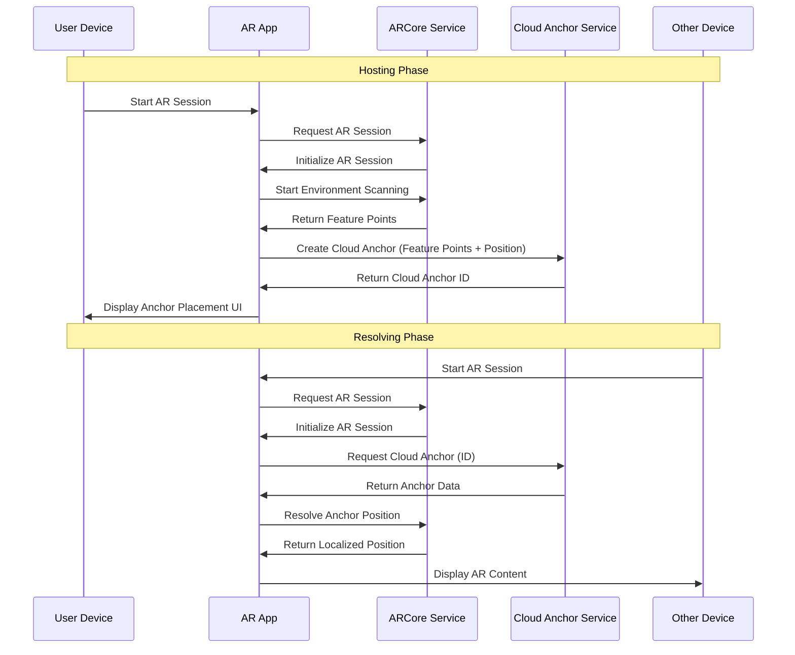
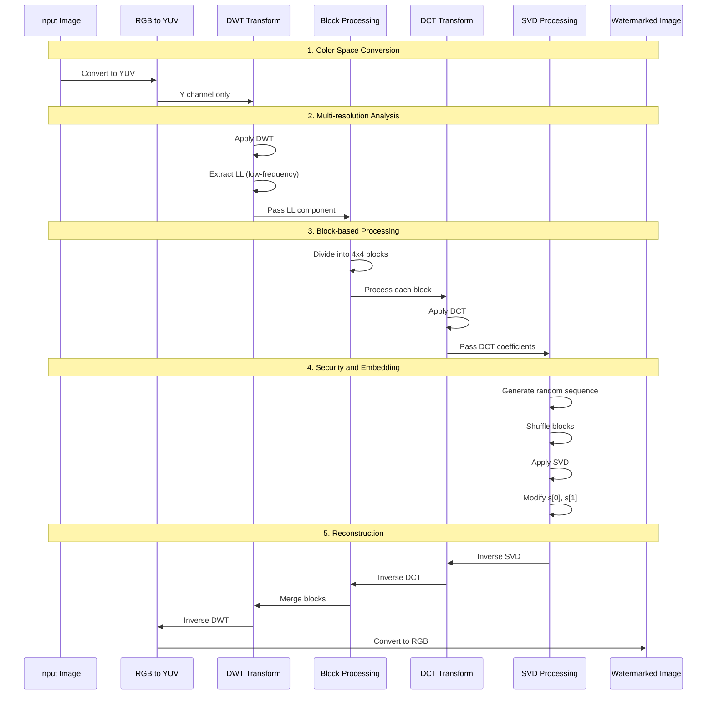
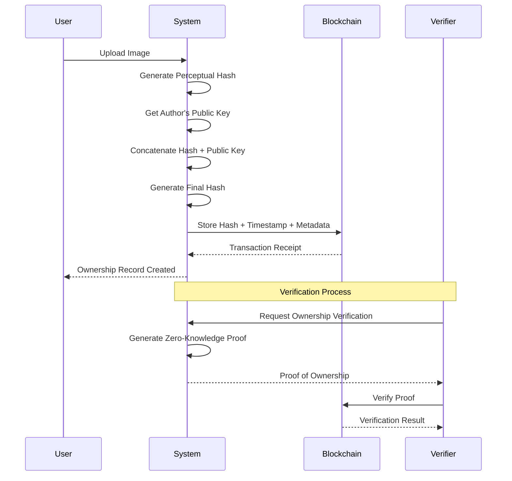
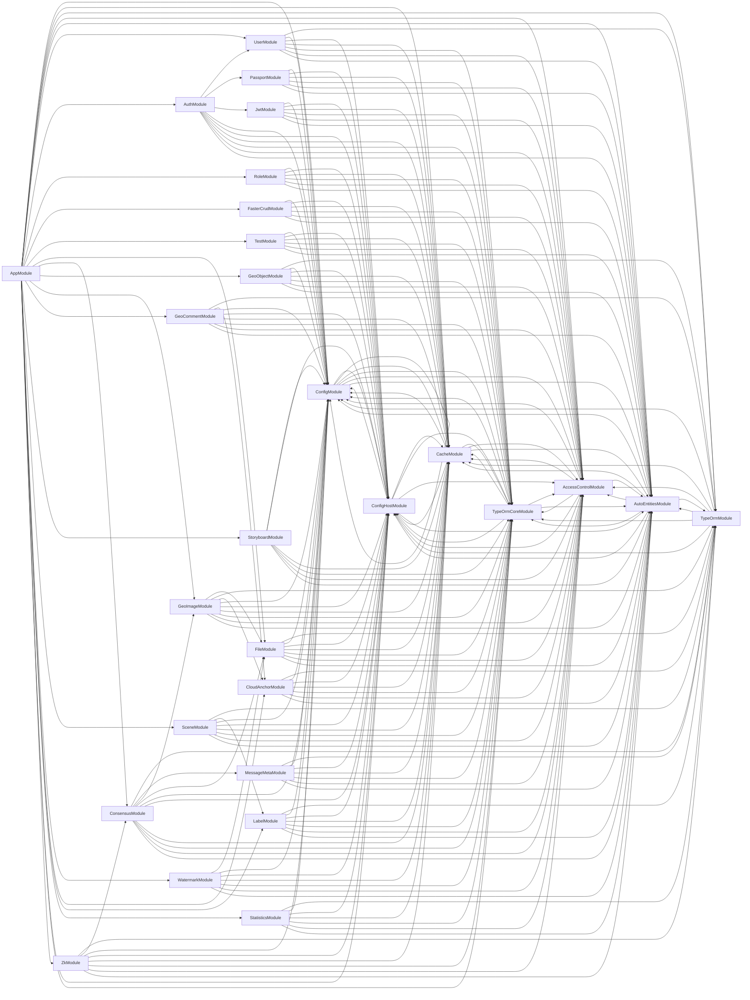

```mermaid
sequenceDiagram
    participant User as User Device
    participant App as AR App
    participant ARCore as ARCore Service
    participant Cloud as Cloud Anchor Service
    participant Other as Other Device

    Note over User,Other: Hosting Phase
    User->>App: Start AR Session
    App->>ARCore: Request AR Session
    ARCore->>App: Initialize AR Session
    App->>ARCore: Start Environment Scanning
    ARCore->>App: Return Feature Points
    App->>Cloud: Create Cloud Anchor (Feature Points + Position)
    Cloud->>App: Return Cloud Anchor ID
    App->>User: Display Anchor Placement UI

    Note over User,Other: Resolving Phase
    Other->>App: Start AR Session
    App->>ARCore: Request AR Session
    ARCore->>App: Initialize AR Session
    App->>Cloud: Request Cloud Anchor (ID)
    Cloud->>App: Return Anchor Data
    App->>ARCore: Resolve Anchor Position
    ARCore->>App: Return Localized Position
    App->>Other: Display AR Content
```

```mermaid
sequenceDiagram
    participant Input as Input Image
    participant RGB2YUV as RGB to YUV
    participant DWT as DWT Transform
    participant Block as Block Processing
    participant DCT as DCT Transform
    participant SVD as SVD Processing
    participant Output as Watermarked Image

    Note over Input,Output: 1. Color Space Conversion
    Input->>RGB2YUV: Convert to YUV
    RGB2YUV->>DWT: Y channel only

    Note over Input,Output: 2. Multi-resolution Analysis
    DWT->>DWT: Apply DWT
    DWT->>DWT: Extract LL (low-frequency)
    DWT->>Block: Pass LL component

    Note over Input,Output: 3. Block-based Processing
    Block->>Block: Divide into 4x4 blocks
    Block->>DCT: Process each block
    DCT->>DCT: Apply DCT
    DCT->>SVD: Pass DCT coefficients

    Note over Input,Output: 4. Security and Embedding
    SVD->>SVD: Generate random sequence
    SVD->>SVD: Shuffle blocks
    SVD->>SVD: Apply SVD
    SVD->>SVD: Modify s[0], s[1]

    Note over Input,Output: 5. Reconstruction
    SVD->>DCT: Inverse SVD
    DCT->>Block: Inverse DCT
    Block->>DWT: Merge blocks
    DWT->>RGB2YUV: Inverse DWT
    RGB2YUV->>Output: Convert to RGB
```

```mermaid

  sequenceDiagram
    participant User
    participant System
    participant Blockchain
    participant Verifier

    User->>System: Upload Image
    System->>System: Generate Perceptual Hash
    System->>System: Get Author's Public Key
    System->>System: Concatenate Hash + Public Key
    System->>System: Generate Final Hash
    System->>Blockchain: Store Hash + Timestamp + Metadata
    Blockchain-->>System: Transaction Receipt
    System-->>User: Ownership Record Created

    Note over Verifier, System: Verification Process
    Verifier->>System: Request Ownership Verification
    System->>System: Generate Zero-Knowledge Proof
    System-->>Verifier: Proof of Ownership
    Verifier->>Blockchain: Verify Proof
    Blockchain-->>Verifier: Verification Result

```

```mermaid
graph LR
  AppModule-->ConfigModule
  ConfigModule-->ConfigHostModule
  ConfigHostModule-->ConfigModule
  ConfigHostModule-->CacheModule
  CacheModule-->ConfigModule
  CacheModule-->ConfigHostModule
  CacheModule-->TypeOrmCoreModule
  TypeOrmCoreModule-->ConfigModule
  TypeOrmCoreModule-->ConfigHostModule
  TypeOrmCoreModule-->CacheModule
  TypeOrmCoreModule-->AccessControlModule
  AccessControlModule-->ConfigModule
  AccessControlModule-->ConfigHostModule
  AccessControlModule-->CacheModule
  AccessControlModule-->TypeOrmCoreModule
  AccessControlModule-->AutoEntitiesModule
  AutoEntitiesModule-->TypeOrmModule
  TypeOrmModule-->ConfigModule
  TypeOrmModule-->ConfigHostModule
  TypeOrmModule-->CacheModule
  TypeOrmModule-->TypeOrmCoreModule
  TypeOrmModule-->AccessControlModule
  TypeOrmModule-->AutoEntitiesModule
  AutoEntitiesModule-->ConfigModule
  AutoEntitiesModule-->ConfigHostModule
  AutoEntitiesModule-->CacheModule
  AutoEntitiesModule-->TypeOrmCoreModule
  AutoEntitiesModule-->AccessControlModule
  TypeOrmCoreModule-->AutoEntitiesModule
  CacheModule-->AccessControlModule
  CacheModule-->AutoEntitiesModule
  ConfigHostModule-->TypeOrmCoreModule
  ConfigHostModule-->AccessControlModule
  ConfigHostModule-->AutoEntitiesModule
  ConfigModule-->ConfigModule
  ConfigModule-->CacheModule
  ConfigModule-->TypeOrmCoreModule
  ConfigModule-->AccessControlModule
  ConfigModule-->AutoEntitiesModule
  AppModule-->CacheModule
  AppModule-->TypeOrmModule
  AppModule-->AccessControlModule
  AppModule-->AutoEntitiesModule
  AppModule-->UserModule
  UserModule-->TypeOrmModule
  UserModule-->ConfigModule
  UserModule-->ConfigHostModule
  UserModule-->CacheModule
  UserModule-->TypeOrmCoreModule
  UserModule-->AccessControlModule
  UserModule-->AutoEntitiesModule
  AppModule-->AuthModule
  AuthModule-->UserModule
  AuthModule-->PassportModule
  PassportModule-->ConfigModule
  PassportModule-->ConfigHostModule
  PassportModule-->CacheModule
  PassportModule-->TypeOrmCoreModule
  PassportModule-->AccessControlModule
  PassportModule-->AutoEntitiesModule
  AuthModule-->JwtModule
  JwtModule-->ConfigModule
  JwtModule-->ConfigHostModule
  JwtModule-->CacheModule
  JwtModule-->TypeOrmCoreModule
  JwtModule-->AccessControlModule
  JwtModule-->AutoEntitiesModule
  AuthModule-->ConfigModule
  AuthModule-->ConfigHostModule
  AuthModule-->CacheModule
  AuthModule-->TypeOrmCoreModule
  AuthModule-->AccessControlModule
  AuthModule-->AutoEntitiesModule
  AppModule-->RoleModule
  RoleModule-->ConfigModule
  RoleModule-->ConfigHostModule
  RoleModule-->CacheModule
  RoleModule-->TypeOrmCoreModule
  RoleModule-->AccessControlModule
  RoleModule-->AutoEntitiesModule
  AppModule-->FasterCrudModule
  FasterCrudModule-->ConfigModule
  FasterCrudModule-->ConfigHostModule
  FasterCrudModule-->CacheModule
  FasterCrudModule-->TypeOrmCoreModule
  FasterCrudModule-->AccessControlModule
  FasterCrudModule-->AutoEntitiesModule
  AppModule-->TestModule
  TestModule-->ConfigModule
  TestModule-->ConfigHostModule
  TestModule-->CacheModule
  TestModule-->TypeOrmCoreModule
  TestModule-->AccessControlModule
  TestModule-->AutoEntitiesModule
  AppModule-->FileModule
  FileModule-->TypeOrmModule
  FileModule-->ConfigModule
  FileModule-->ConfigHostModule
  FileModule-->CacheModule
  FileModule-->TypeOrmCoreModule
  FileModule-->AccessControlModule
  FileModule-->AutoEntitiesModule
  AppModule-->ConsensusModule
  ConsensusModule-->TypeOrmModule
  ConsensusModule-->MessageMetaModule
  MessageMetaModule-->TypeOrmModule
  MessageMetaModule-->ConfigModule
  MessageMetaModule-->ConfigHostModule
  MessageMetaModule-->CacheModule
  MessageMetaModule-->TypeOrmCoreModule
  MessageMetaModule-->AccessControlModule
  MessageMetaModule-->AutoEntitiesModule
  ConsensusModule-->GeoImageModule
  GeoImageModule-->FileModule
  GeoImageModule-->TypeOrmModule
  GeoImageModule-->CloudAnchorModule
  CloudAnchorModule-->TypeOrmModule
  CloudAnchorModule-->ConfigModule
  CloudAnchorModule-->ConfigHostModule
  CloudAnchorModule-->CacheModule
  CloudAnchorModule-->TypeOrmCoreModule
  CloudAnchorModule-->AccessControlModule
  CloudAnchorModule-->AutoEntitiesModule
  GeoImageModule-->ConfigModule
  GeoImageModule-->ConfigHostModule
  GeoImageModule-->CacheModule
  GeoImageModule-->TypeOrmCoreModule
  GeoImageModule-->AccessControlModule
  GeoImageModule-->AutoEntitiesModule
  ConsensusModule-->FileModule
  ConsensusModule-->ConfigModule
  ConsensusModule-->ConfigHostModule
  ConsensusModule-->CacheModule
  ConsensusModule-->TypeOrmCoreModule
  ConsensusModule-->AccessControlModule
  ConsensusModule-->AutoEntitiesModule
  AppModule-->GeoObjectModule
  GeoObjectModule-->TypeOrmModule
  GeoObjectModule-->ConfigModule
  GeoObjectModule-->ConfigHostModule
  GeoObjectModule-->CacheModule
  GeoObjectModule-->TypeOrmCoreModule
  GeoObjectModule-->AccessControlModule
  GeoObjectModule-->AutoEntitiesModule
  AppModule-->GeoImageModule
  AppModule-->GeoCommentModule
  GeoCommentModule-->TypeOrmModule
  GeoCommentModule-->CloudAnchorModule
  GeoCommentModule-->ConfigModule
  GeoCommentModule-->ConfigHostModule
  GeoCommentModule-->CacheModule
  GeoCommentModule-->TypeOrmCoreModule
  GeoCommentModule-->AccessControlModule
  GeoCommentModule-->AutoEntitiesModule
  AppModule-->StoryboardModule
  StoryboardModule-->ConfigModule
  StoryboardModule-->ConfigHostModule
  StoryboardModule-->CacheModule
  StoryboardModule-->TypeOrmCoreModule
  StoryboardModule-->AccessControlModule
  StoryboardModule-->AutoEntitiesModule
  AppModule-->SceneModule
  SceneModule-->TypeOrmModule
  SceneModule-->LabelModule
  LabelModule-->TypeOrmModule
  LabelModule-->ConfigModule
  LabelModule-->ConfigHostModule
  LabelModule-->CacheModule
  LabelModule-->TypeOrmCoreModule
  LabelModule-->AccessControlModule
  LabelModule-->AutoEntitiesModule
  SceneModule-->ConfigModule
  SceneModule-->ConfigHostModule
  SceneModule-->CacheModule
  SceneModule-->TypeOrmCoreModule
  SceneModule-->AccessControlModule
  SceneModule-->AutoEntitiesModule
  AppModule-->WatermarkModule
  WatermarkModule-->FileModule
  WatermarkModule-->ConfigModule
  WatermarkModule-->ConfigHostModule
  WatermarkModule-->CacheModule
  WatermarkModule-->TypeOrmCoreModule
  WatermarkModule-->AccessControlModule
  WatermarkModule-->AutoEntitiesModule
  AppModule-->CloudAnchorModule
  AppModule-->LabelModule
  AppModule-->StatisticsModule
  StatisticsModule-->TypeOrmModule
  StatisticsModule-->ConfigModule
  StatisticsModule-->ConfigHostModule
  StatisticsModule-->CacheModule
  StatisticsModule-->TypeOrmCoreModule
  StatisticsModule-->AccessControlModule
  StatisticsModule-->AutoEntitiesModule
  AppModule-->ZkModule
  ZkModule-->TypeOrmModule
  ZkModule-->ConsensusModule
  ZkModule-->ConfigModule
  ZkModule-->ConfigHostModule
  ZkModule-->CacheModule
  ZkModule-->TypeOrmCoreModule
  ZkModule-->AccessControlModule
  ZkModule-->AutoEntitiesModule
  AppModule-->ConfigHostModule
  AppModule-->TypeOrmCoreModule
```

